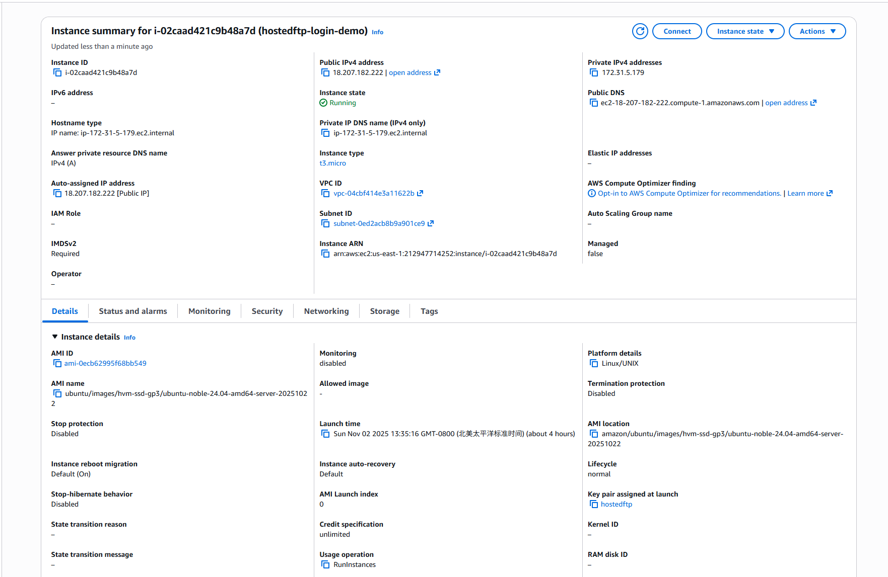
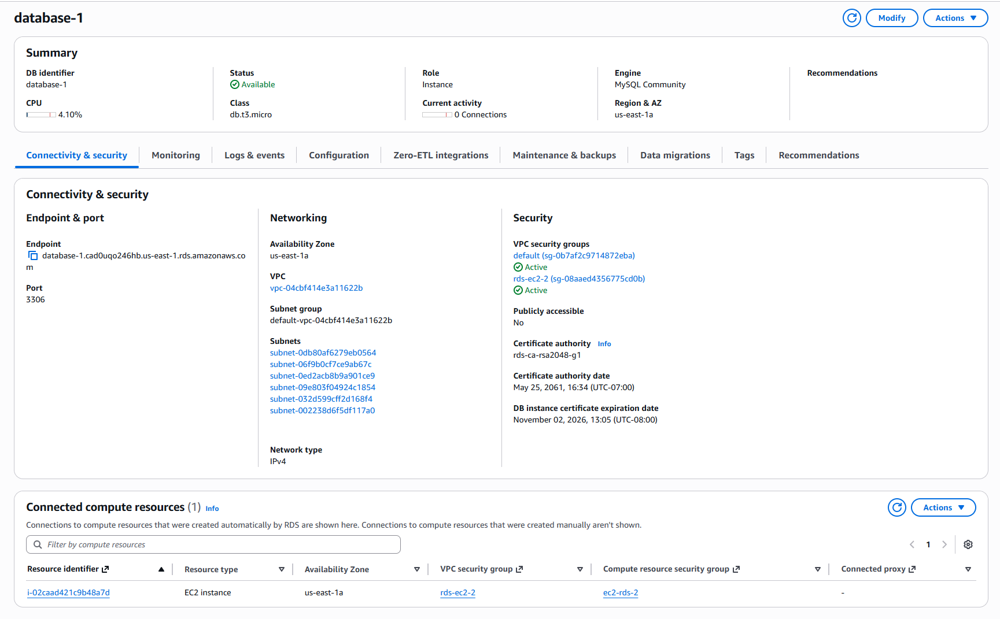

# Minimal Pure-Java Tomcat Login Demo (MySQL + SSL)

This is a **from-scratch** Java webapp (no Spring/Boot, no frameworks) using:
- JSP + Servlets
- JDBC to MySQL
- PBKDF2 with per-user random salt (no plaintext!) for **improved password security**
- A startup servlet that **creates the `users` table** and **seeds a default account**:
  - Username: **hostedftp**
  - Password: **money**

## Project layout

```
webapp/
  index.jsp
  welcome.jsp
  tools/dbcheck.jsp
  WEB-INF/web.xml
  WEB-INF/lib/mysql-connector-j-8.4.0.jar

src/
  com/hostedftp/auth/
    PasswordUtil.java
    DB.java
    DbConfig.java
    LoginServlet.java
  db.properties
```

---

## 1) Run locally in Eclipse + Tomcat
1. Install **Eclipse IDE for Enterprise Java and Web Developers**.
2. Install **Apache Tomcat 9** (or 10.1). In Eclipse, add it via *Servers* view.
3. Install **MySQL** locally and create a database:
   ```sql
   CREATE DATABASE demo;
   ```
4. Add the **MySQL JDBC driver** (Connector/J) jar to your webapp's build path and `WEB-INF/lib`.
5. Set environment variables for Tomcat (in *Run Configurations → Environment* or setenv script):
   - `DB_URL=jdbc:mysql://localhost:3306/demo?useSSL=false&allowPublicKeyRetrieval=true`
   - `DB_USER=root`
   - `DB_PASS=yourpassword`
   
   or modify db.properties.
6. **Enable HTTPS in Tomcat (self‑signed for local)**:
   ```bash
   keytool -genkeypair -alias tomcat -keyalg RSA -keysize 2048 -keystore $CATALINA_BASE/keystore.jks -validity 365 \
     -storepass changeit -keypass changeit -dname "CN=localhost, OU=Dev, O=Demo, L=City, S=State, C=US"

   # In conf/server.xml, enable the HTTPS connector (example):
   # <Connector port="8443" protocol="org.apache.coyote.http11.Http11NioProtocol"
   #            SSLEnabled="true" maxThreads="150" scheme="https" secure="true"
   #            keystoreFile="conf/../keystore.jks" keystorePass="changeit"
   #            clientAuth="false" sslProtocol="TLS"/>
   ```
7. Deploy to Tomcat from Eclipse. Visit: `https://localhost:8443/hostedftp-login-demo/`
8. **Login** with `hostedftp` / `money`. The first request seeds the user if missing.

## 2) Deploy to AWS (EC2 + RDS)

> This uses only free-tier types: **t3.micro** for EC2 and **db.t3.micro** for RDS MySQL.

### EC2 setup
Refer to `ec2_setup.sh` for dependency install.



### SSL on EC2
**Self-signed (quickest)**
```bash
sudo keytool -genkeypair   -alias tomcat   -keyalg RSA   -keysize 2048   -validity 825   -keystore localhost-rsa.jks   -storepass changeit   -keypass changeit   -dname "CN=localhost, OU=Dev, O=YourOrg, L=Vancouver, ST=BC, C=CA"   -ext "SAN=dns:localhost,ip:127.0.0.1"

sudo sed -i 's@<!-- Define an SSL/TLS HTTP/1.1 Connector.*@<Connector port="8443" protocol="org.apache.coyote.http11.Http11NioProtocol" SSLEnabled="true" maxThreads="150" scheme="https" secure="true" keystoreFile="/opt/tomcat/conf/localhost-rsa.jks" keystorePass="changeit" clientAuth="false" sslProtocol="TLS" />@' /opt/tomcat/conf/server.xml
sudo systemctl restart tomcat9
```

### Deploy the WAR
1. Download the zip from this chat and build a WAR in Eclipse (Export → WAR file) **or** compile on EC2.
2. Copy `hostedftp-login-demo.war` to `/opt/tomcat/webapps/`:
   ```bash
   sudo cp hostedftp-login-demo.war /opt/tomcat/webapps/
   sudo systemctl restart tomcat9
   ```

---

## AI tool usage reference
> https://chatgpt.com/share/6907a518-13e8-8002-8bcd-7d11d7ce955b

## Demo on AWS EC2
https://18.207.182.222:8443/hostedftp-login-demo
> Notice that the demo is deployed using self-signed certificate. It is expected to report a warning during the first visit. 